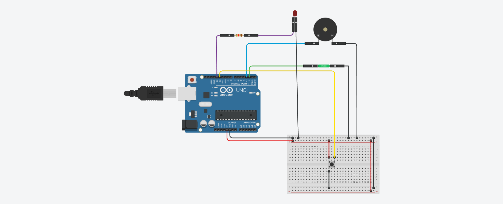

<p align="center">
  
</p>

# TiltAlert

## Description
TiltAlert est un dispositif de détection de chocs et d’inclinaisons basé sur une plateforme Arduino. Il surveille des colis ou équipements sensibles et déclenche des alertes sonores et visuelles en cas de dépassement d’un seuil critique.

## Fonctionnalités
- Détection précise des inclinaisons via un capteur KY-020.
- Alertes sonores avec un buzzer et visuelles avec une LED rouge.
- Réinitialisation facile avec un bouton poussoir.
- Applications : logistique, transport sécurisé, surveillance industrielle.

## Installation
1. Clonez ce repository :
   ```bash
   git clone https://github.com/votre-nom-utilisateur/TiltAlert.git
   ```
2. Téléchargez le fichier `tiltalert.ino` dans l’IDE Arduino.
3. Connectez les composants selon le [schéma de câblage](./hardware/wiring_diagram.png).
4. Téléversez le code dans votre carte Arduino.

## Matériel Requis
- 1x Arduino Uno
- 1x Breadboard
- 1x KY-020 (capteur d’inclinaison)
- 1x KY-012 (buzzer)
- 1x KY-004 (bouton poussoir)
- 1x LED (rouge)
- Résistances : 220Ω, 10kΩ
- Câbles de connexion

## Utilisation
1. Démarrez le système en connectant l’Arduino à une source d’alimentation.
2. Inclinez l’objet surveillé pour détecter les chocs ou inclinaisons.
3. Une alarme se déclenche après 5 inclinaisons critiques.
4. Appuyez sur le bouton poussoir pour réinitialiser.

## Schéma de Câblage


## Résultats et Tests
- Inclinaison détectée : LED et buzzer activés.
- Bouton poussoir : Réinitialisation du système.

## Licence
Ce projet est sous licence [MIT](./LICENSE).
