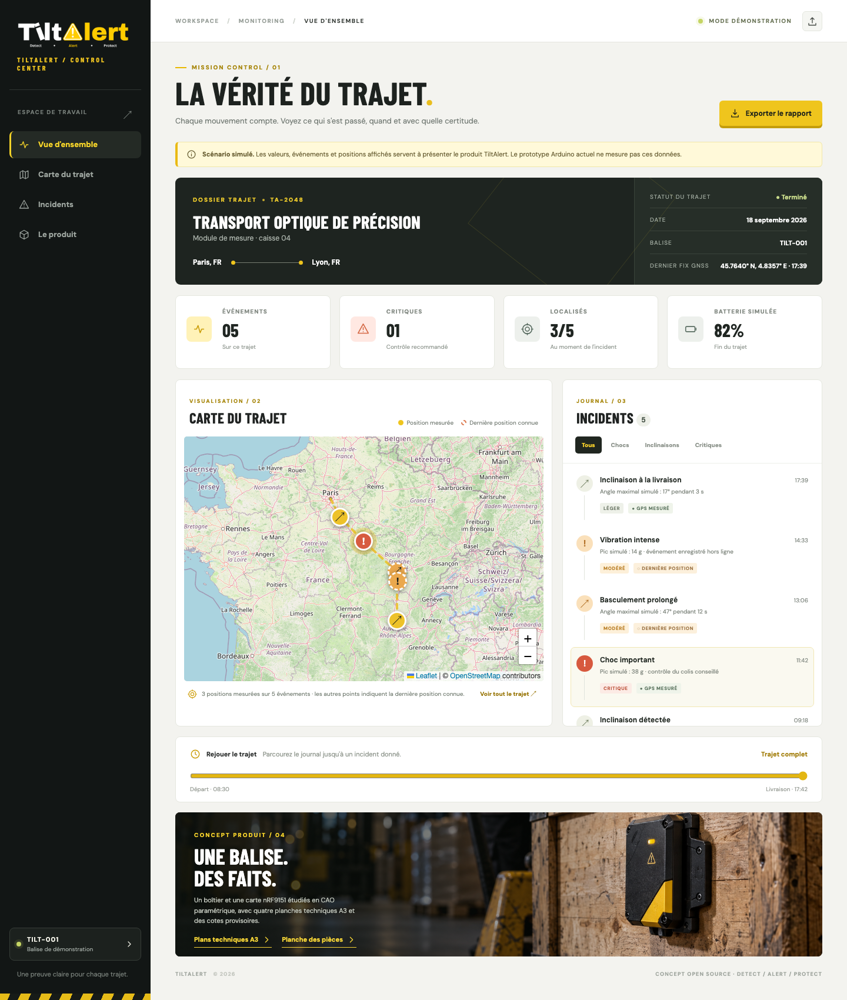
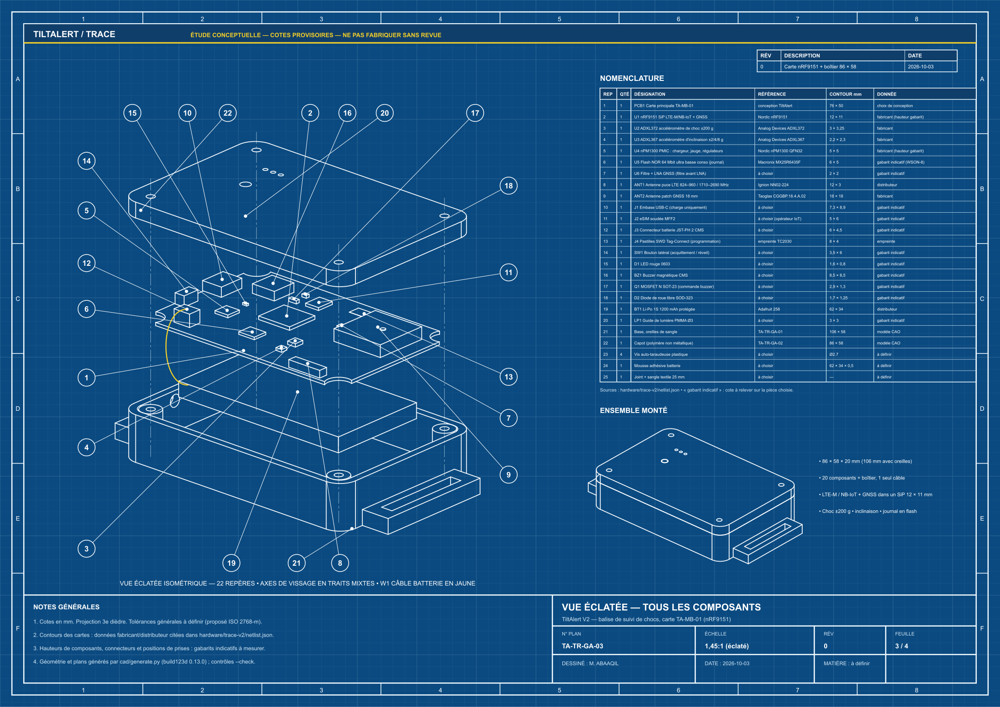
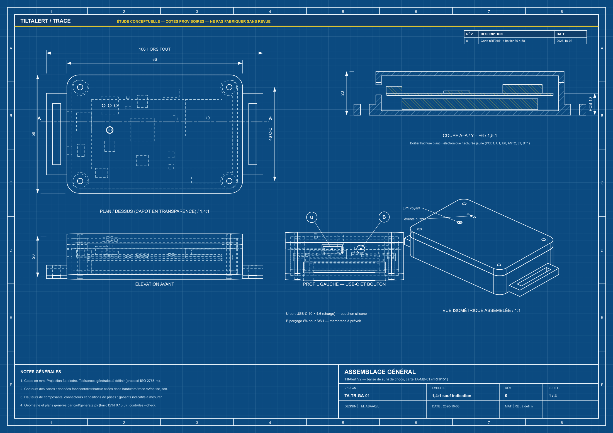
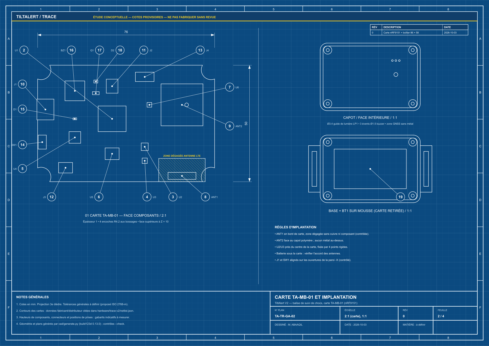
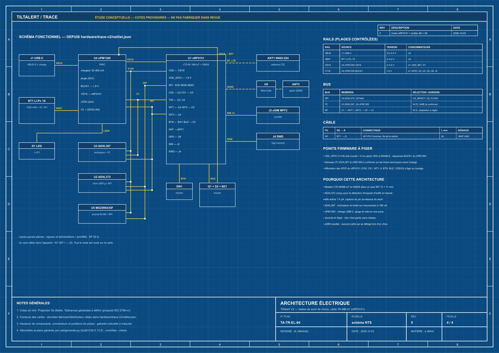
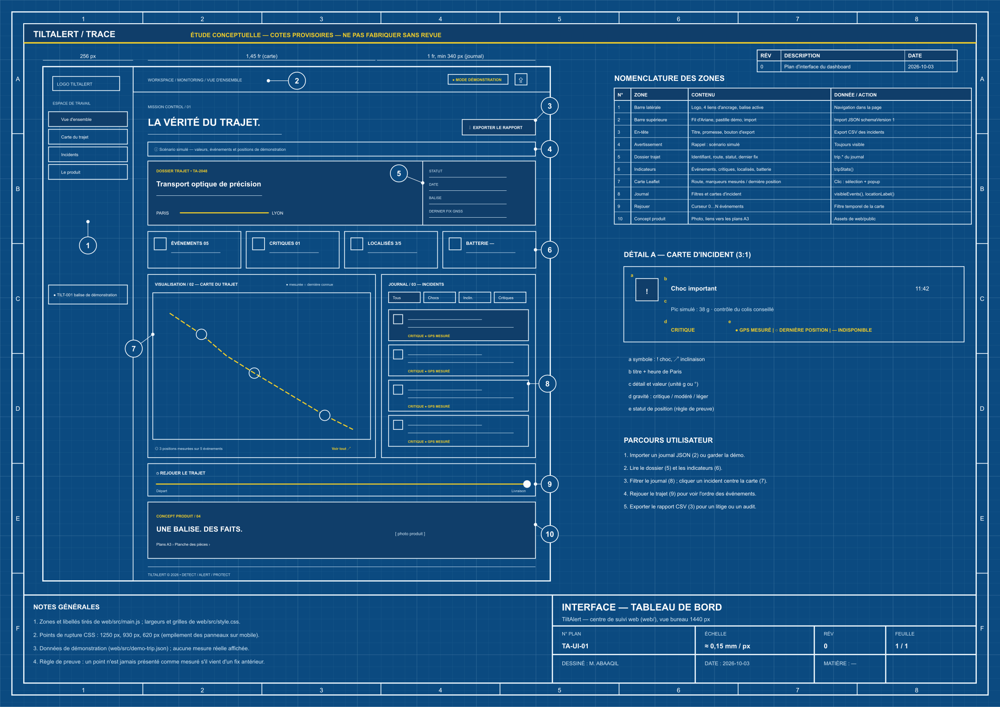
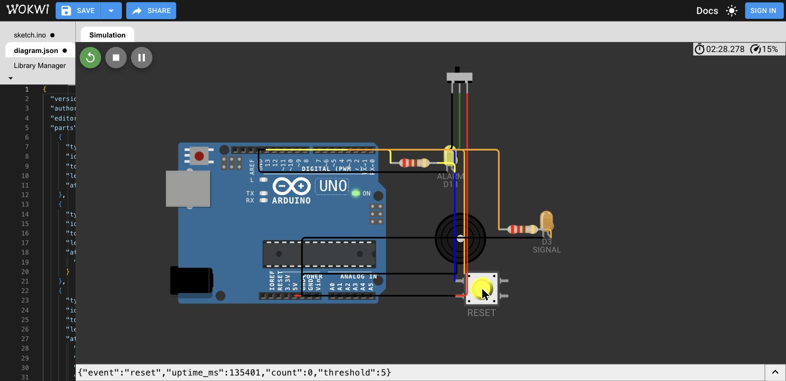
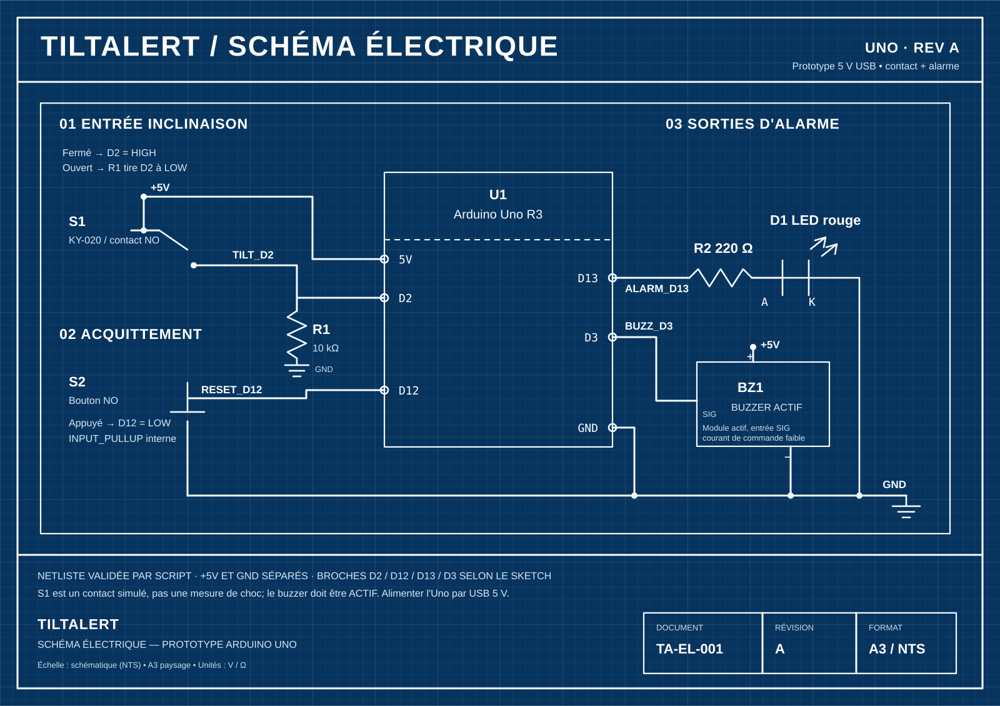
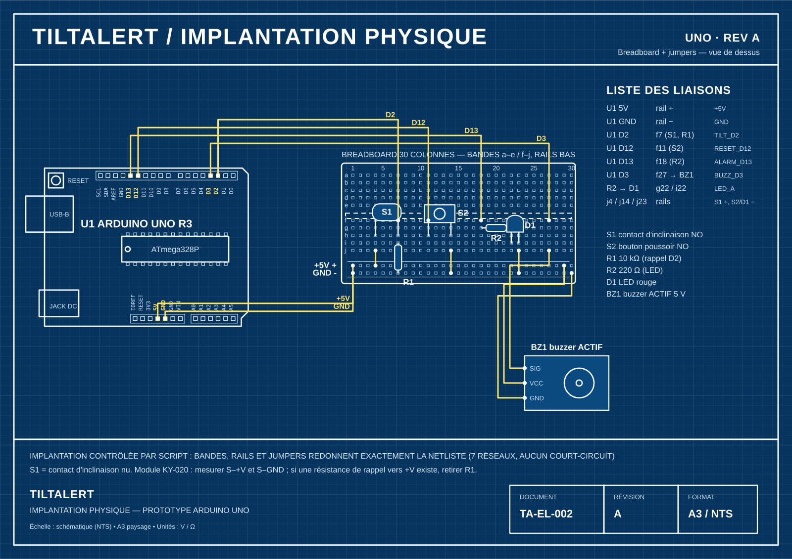
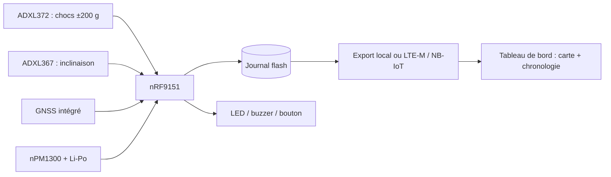

<p align="center">
  
</p>

<h1 align="center">Chaque choc laisse une trace.<br>Chaque colis mérite une preuve.</h1>

<p align="center">
  <strong>TiltAlert</strong> est la balise open source qui donne une mémoire aux colis fragiles.<br>
  Elle détecte chaque choc et chaque basculement, alerte sur place, et rend le trajet <em>lisible</em> : quand, à quelle force, avec quelle certitude de position.
</p>

<p align="center">
  
</p>
<p align="center"><sub>Visualisation du concept (image générée, voir <a href="./documentation/IMAGE_PROMPT.md">le prompt</a>) — pas une photo d'un boîtier fabriqué.</sub></p>

---

## 1. Le problème : personne ne sait *quand* ça a cassé

Une optique de précision part de Paris et arrive à Lyon **fendue**. L'expéditeur, le transporteur et le destinataire voient le résultat. Personne ne peut dire **quand** le choc a eu lieu, **à quelle étape**, ni s'il s'agit d'une chute isolée ou d'un trajet entier mal manipulé.

Les étiquettes « FRAGILE » avertissent. Elles ne racontent rien. Résultat :

- des litiges où chacun renvoie la responsabilité à l'autre, **sans preuve** ;
- des assurances qui paient à l'aveugle, ou refusent à l'aveugle ;
- des étapes du transport qui restent mauvaises parce que **personne ne sait lesquelles** ;
- des indicateurs jetables qui disent « choc détecté » sans dire quand ni où.

## 2. La solution : une balise qui raconte le trajet

TiltAlert se fixe à une caisse. Elle fait trois choses, et les fait bien — **Detect, Alert, Protect** :

| | |
| --- | --- |
| **Detect — détecter** | Un accéléromètre dédié aux impacts (jusqu'à ±200 g) et un capteur d'inclinaison surveillent le colis en permanence, avec une consommation de veille de l'ordre du microampère. |
| **Alert — alerter** | LED, buzzer et bouton d'acquittement : après cinq basculements confirmés, l'alarme se déclenche **sur place**, là où quelqu'un peut encore réagir. |
| **Protect — prouver** | Chaque événement est enregistré dans un journal local (heure relative, valeur mesurée, état de la position). Le tableau de bord le transforme en **preuve intelligible** : carte, chronologie, rapport exportable. |

> **Pitch en 45 secondes.** « Vous expédiez une pièce fragile. Elle arrive cassée. Vous savez *quoi*, mais personne ne peut dire *quand* ni *à quelle étape*. TiltAlert donne une mémoire au colis : une balise réutilisable détecte l'incident, le journal le conserve et l'interface le rend compréhensible. Les équipes peuvent isoler les trajets problématiques au lieu de débattre sans preuve. Nous construisons un outil ouvert, réparable et adapté aux flux logistiques réels. »

### La règle d'or : on ne ment jamais sur la position

C'est le détail qui change tout. Un GNSS ne fonctionne pas dans un conteneur. Plutôt que de coller un point faux sur la carte, TiltAlert **affiche son niveau de certitude** :

| Statut | Ce que ça veut dire | Sur la carte |
| --- | --- | --- |
| ● **Position mesurée** | Un fix valide existe au moment exact de l'événement. | Marqueur plein |
| ○ **Dernière position connue** | Fix plus ancien : son âge est affiché, jamais présenté comme le lieu du choc. | Marqueur pointillé |
| — **Indisponible** | Aucun fix exploitable. | L'événement reste dans la chronologie, sans point |

Une preuve n'a de valeur que si elle dit aussi ce qu'elle ne sait pas.

---

## 3. Voir TiltAlert en action

### Le tableau de bord : « La vérité du trajet »

Carte interactive, journal d'incidents filtrable, replay du trajet, import de journal JSON, export CSV pour un litige ou un audit. [Code dans `web/`](./web/) — le trajet affiché est un **scénario de démonstration**, signalé comme tel dans l'interface.



### Le blueprint : tous les composants sur une seule page

Vue éclatée de la balise V2 : **22 repères**, 25 lignes de nomenclature, axes de vissage, câble batterie. Tout est généré depuis un modèle 3D paramétrique, pas dessiné à la main.



<details>
<summary><strong>Voir les trois autres planches du jeu A3</strong> · <a href="./documentation/tiltalert-trace-plans-A3.pdf">PDF complet (4 pages)</a></summary>







</details>

### Le blueprint de l'interface

Le tableau de bord lui-même est dessiné comme un plan : dix zones numérotées liées au vrai code, détail d'une carte d'incident, parcours utilisateur. [PDF](./documentation/tiltalert-interface-blueprint.pdf).



### La preuve de concept : le vrai firmware, en simulation

Le firmware réel (`code/tiltalert.ino`) tourne dans un simulateur de l'Arduino Uno. Cinq basculements déclenchent l'alarme, un appui sur RESET l'acquitte.

| 1 · Cinq basculements → alarme | 2 · Acquittement |
| --- | --- |
|  |  |

Le journal série prouve la séquence complète : `ready` → 5 × `tilt` → `alarm` → `reset`. [Capture du journal](./simulation/captures/wokwi-serial-log.jpg).

Le même prototype, documenté comme un vrai montage :





---

## 4. Sous le capot : la balise V2

Une **carte unique sur mesure** (TA-MB-01, 76 × 50 mm) dans un boîtier de **86 × 58 × 20 mm**. Chaque choix est sourcé dans [`hardware/trace-v2/`](./hardware/trace-v2/README.md).

| Fonction | Composant | Pourquoi celui-là |
| --- | --- | --- |
| Cerveau + réseau + GPS | [Nordic nRF9151](https://www.nordicsemi.com/Products/nRF9151) (12 × 11 mm) | Modem LTE-M/NB-IoT **et** GNSS intégrés : plus de modules empilés. |
| Chocs | [ADXL372](https://www.analog.com/en/products/adxl372.html), ±200 g | Conçu pour les impacts d'actifs en transit : veille active 1,4 µA, capture du pic au-dessus du seuil. |
| Inclinaison | [ADXL367](https://www.analog.com/en/products/adxl367.html) | Réveil sur mouvement à 180 nA. |
| Énergie | [nPM1300](https://www.nordicsemi.com/Products/nPM1300) | Charge USB-C, jauge de batterie et rails en une puce. |
| Mémoire | Flash 64 Mbit basse conso | Le journal survit sans réseau. |
| Antennes | Puce LTE + patch GNSS | Zone dégagée dédiée, contrôlée dans le modèle. |
| SIM | eSIM soudée | Aucune carte qui se déloge lors d'un choc. |

**Un seul câble** dans tout l'appareil (la batterie). Le reste est routé sur la carte.

### Un design qui se vérifie lui-même

À chaque génération des plans, un script contrôle que :

- les **20 composants tiennent** dans la cavité sans toucher une paroi, un bossage ou un autre composant (jeu ≥ 0,2 mm) ;
- chaque **tension d'alimentation** est dans la plage de chaque composant alimenté ;
- les **adresses I²C et sélections SPI** sont distinctes ;
- l'**antenne LTE** garde sa zone dégagée ;
- les ouvertures **USB-C et bouton** traversent bien la paroi en face de leurs composants.

Ces contrôles ont été éprouvés en leur injectant volontairement des erreurs (rail à 3,3 V, conflit d'adresse, composant dans la zone d'antenne) : ils les détectent.


```mermaid
flowchart LR
  A[ADXL372 : chocs ±200 g] --> M[nRF9151]
  B[ADXL367 : inclinaison] --> M
  G[GNSS intégré] --> M
  M --> J[(Journal flash)]
  J --> S[Export local ou LTE-M / NB-IoT]
  S --> W[Tableau de bord : carte + chronologie]
  M --> L[LED / buzzer / bouton]
  P[nPM1300 + Li-Po] --> M
```

---

## 5. Où en est-on, honnêtement

TiltAlert est un projet **ouvert et vérifiable**. Voici ce qui est prouvé, et ce qui reste à prouver avant toute promesse commerciale.

| ✅ Prouvé dans ce dépôt | 🔬 À prouver sur matériel réel |
| --- | --- |
| Firmware Uno : anti-rebond, seuil de 5 basculements, alarme latchée, acquittement, débordement de `millis()` — tests C++ et simulation du binaire compilé. | Calibration des seuils de choc et d'inclinaison sur un colis réel, taux de faux positifs. |
| Tableau de bord : format de trajet, statistiques, distinction des positions, export CSV — tests et build. | Journal qui survit à une coupure d'alimentation, sans doublons à la synchronisation. |
| Architecture V2 : netlist, rails, bus, encombrement et dégagements contrôlés par script. | Qualité des fixes GNSS en véhicule et en conteneur, accord des antennes. |
| Plans A3 générés depuis le modèle 3D, STEP/STL du boîtier et de l'assemblage. | Autonomie mesurée, tenue du boîtier, essais de transport. |

Les données du tableau de bord (événements, positions) sont **fictives**. Prix, autonomie, retour sur investissement : **non mesurés**. Les indicateurs d'impact et traceurs du marché existent déjà ([SpotSee](https://spotsee.io/wp-content/uploads/2019/07/Impact-Indicators-for-Packaging_English-01-19-2022-1.pdf), [Tive](https://www.tive.com/disposable-trackers/solo-pro-tracker)) : l'ambition de TiltAlert est une approche **ouverte, réparable et lisible**, avec une preuve qui dit ce qu'elle ne sait pas.

**Marché visé :** transport de pièces industrielles, matériel audiovisuel, objets fragiles de valeur. **Modèle à tester :** vente ou location de balises, puis abonnement pour la synchronisation et les rapports d'équipe.

### La suite

1. Écrire le firmware V2 sur une carte de développement [Nordic Thingy:91 X](https://docs.nordicsemi.com/r/bundle/ug_thingy91x/page/ug/thingy91x/intro/frontpage.html) : détection d'impacts, journal, envoi LTE-M, fix GNSS.
2. Router le PCB à 4 couches, revue RF.
3. Monter, mesurer, calibrer sur des chocs étalonnés.
4. Exporter de vrais journaux au format du tableau de bord.
5. Prototyper le boîtier et passer des essais de transport.

---

## 6. Explorer le dépôt

| Livrable | Contenu |
| --- | --- |
| [Tableau de bord](./web/) | Carte, chronologie, filtres, replay, import JSON, export CSV. |
| [Plans techniques A3](./documentation/tiltalert-trace-plans-A3.pdf) | 4 planches : assemblage, carte, vue éclatée + nomenclature, architecture électrique. |
| [Blueprint de l'interface](./documentation/tiltalert-interface-blueprint.pdf) | Zones numérotées, nomenclature, parcours utilisateur. |
| [Carte V2 nRF9151](./hardware/trace-v2/README.md) | Choix des composants, contrôles, points à lever avant routage. |
| [Modèle CAO](./cad/README.md) | build123d paramétrique ; exports STEP/STL (base, capot, assemblage complet). |
| [Architecture V2](./documentation/TRACE_ARCHITECTURE.md) | Flux d'un incident, règle de localisation, contrat de données. |
| [Prototype Uno](./hardware/validated-uno/README.md) | Netlist, schéma corrigé, implantation breadboard, nomenclature. |
| [Firmware](./code/tiltalert.ino) · [cœur testable](./code/TiltAlertCore.h) | Machine à états sans dépendance Arduino, sortie série JSON Lines. |
| [Simulation](./simulation/README.md) | AVR (binaire réel), circuit Wokwi, [captures](./simulation/captures/), [guide Tinkercad](./simulation/tinkercad/README.md). |
| [Cahier des charges original](./documentation/REPORT.md) | Archive de la première version. |

## 7. Reproduire

```bash
# Tests du firmware (C++) et du tableau de bord
sh tests/run.sh
cd web && npm ci && npm test && npm run build && cd ..

# Plans mécaniques et architecture V2 (Python 3.12, rsvg-convert)
python3.12 -m venv .venv
.venv/bin/python -m pip install -r cad/requirements.txt
.venv/bin/python cad/generate.py --check      # contrôles seuls
.venv/bin/python cad/generate.py              # plans, STEP, STL

# Planches du prototype Uno et blueprint de l'interface
python3 hardware/validated-uno/generate.py
python3 documentation/interface/generate.py

# Simulation du vrai firmware (arduino-cli + avr-gcc requis, voir simulation/README.md)
cd simulation && npm ci && npm test
```

**Lancer le tableau de bord :** `cd web && npm ci && npm run dev`, puis ouvrir l'adresse indiquée par Vite. Prérequis : Node.js 20.19+ ou 22.12+. La carte utilise [Leaflet](https://leafletjs.com/) et [OpenStreetMap](https://www.openstreetmap.org/copyright) (connexion Internet pour le fond de carte, aucune clé API).

**Monter le prototype Uno :** [schéma](./hardware/validated-uno/tiltalert-uno-electrical.pdf) et [implantation](./hardware/validated-uno/tiltalert-uno-physical.svg). Broches : D2 contact d'inclinaison (avec rappel 10 kΩ vers GND si le contact est nu), D3 buzzer **actif**, D13 LED + 220 Ω, D12 bouton vers GND (`INPUT_PULLUP`). Le fichier historique `hardware/wiring_diagram.brd` relie par erreur +5 V et GND : **ne pas le suivre**.

---

<p align="center">
  <strong>TiltAlert</strong> · Detect · Alert · Protect<br>
  <sub>Projet sous <a href="./LICENSE">licence MIT</a>. Cotes et architecture de conception, non validées pour la fabrication.</sub>
</p>
