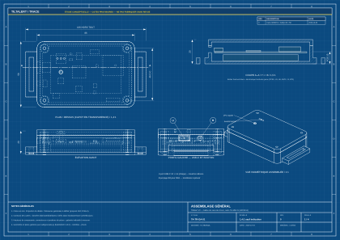

# TiltAlert — architecture de concept



[Ouvrir les quatre plans techniques A3](./tiltalert-trace-plans-A3.pdf) · [Carte V2 nRF9151](../hardware/trace-v2/README.md) · [Source CAO et exports](../cad/README.md)

> **Statut : concept de produit, pas prototype matériel validé.** Les vues mécaniques sont issues d'un modèle paramétrique coté ; leurs dimensions restent provisoires. Elles ne constituent ni un dépôt de brevet, ni un dossier de fabrication validé, ni un schéma électrique.

## Promesse du produit

TiltAlert est une balise réutilisable pour colis et équipements fragiles. Elle conserve une chronologie des chocs et des changements d'orientation, puis aide à comprendre **quand** un incident s'est produit et **quelle position était connue** à ce moment. L'interface associe chaque événement à son niveau de preuve ; elle ne transforme pas une dernière position connue en position exacte du choc.

La version présente dans ce dépôt est un montage Arduino Uno avec capteur de basculement KY-020, LED, buzzer et bouton. Le code compte les transitions du capteur et déclenche l'alarme au cinquième basculement. Le KY-020 fournit un état binaire : il ne mesure ni intensité du choc, ni angle précis. Il n'y a actuellement ni stockage persistant, ni horodatage fiable, ni géolocalisation, ni connexion radio. TiltAlert décrit la prochaine génération envisagée, sans attribuer ces capacités au montage existant.

## Modules envisagés

| Module V2 | Rôle | Point à valider sur prototype |
| --- | --- | --- |
| Boîtier et fixation | Protéger l'électronique et permettre une pose/reprise répétée sur une caisse ou un colis. | Résistance mécanique, accès à la charge, maintien, matériaux, étanchéité éventuelle. |
| Capteur inertiel + microcontrôleur + mémoire non volatile | Mesurer accélération et orientation, classifier l'événement, horodater et garder le journal hors réseau. | Plage et fréquence de mesure adaptées au cas d'usage ; calibration, faux positifs, pertes d'écriture. |
| Récepteur GNSS + liaison radio optionnelle | Obtenir des positions quand les conditions le permettent et synchroniser le journal. | Sensibilité en situation réelle, coût énergétique, couverture et réglementation de la liaison choisie. |
| Batterie rechargeable et circuit de protection | Assurer l'autonomie et enregistrer son état. | Autonomie sur profils de transport réels, sécurité de charge et température. |

Le buzzer et l'indicateur lumineux du prototype actuel peuvent rester comme retour local, à condition d'évaluer leur utilité et leur consommation. Une interface web peut également recevoir un fichier exporté localement avant l'intégration d'une radio.

## Flux d'un incident

1. **Mesurer** : le capteur inertiel collecte les échantillons utiles. Un algorithme distingue une inclinaison soutenue, un choc bref et une manipulation normale. Les seuils sont configurables, puis calibrés avec des essais représentatifs.
2. **Horodater** : l'appareil associe l'événement à son horloge et conserve l'état de synchronisation de cette horloge. Une heure non synchronisée doit être signalée dans le journal.
3. **Enregistrer** : l'événement est écrit en mémoire non volatile avec un identifiant, son type, les mesures disponibles, les seuils actifs, l'état de la batterie et le contexte de position. Une coupure de réseau ne doit pas supprimer l'historique.
4. **Synchroniser** : la liaison transmet les événements quand elle existe. À défaut, un export local ou une synchronisation différée permet de récupérer le journal. Les doublons sont évités par l'identifiant stable de l'événement.
5. **Visualiser** : la carte et la chronologie affichent la source de chaque donnée et l'heure de dernière mise à jour. Un rapport de trajet doit pouvoir exposer les événements et leurs limites de précision.

## Règle de localisation

Un récepteur GNSS peut ne fournir aucun fix exploitable, notamment à l'intérieur d'un bâtiment ou d'un conteneur. La carte doit conserver cette incertitude :

| Affichage | Condition | Ce que cela signifie |
| --- | --- | --- |
| **Position mesurée** | Fix valide associé à l'instant de l'incident selon une fenêtre temporelle et un critère de qualité à définir. | Position observée par le dispositif ; afficher l'heure, la source et l'incertitude fournie. |
| **Dernière position connue** | Pas de fix valable pour l'incident, mais un fix antérieur existe. | Repère historique uniquement ; afficher l'âge du fix et éviter un marqueur présenté comme lieu du choc. |
| **Position indisponible** | Aucun fix exploitable. | L'événement reste dans la chronologie sans point sur la carte. |

Une position interpolée à partir du trajet pourrait être ajoutée plus tard, mais elle devra porter l'étiquette **estimation** et rester visuellement distincte d'une mesure. Le système ne prétend pas déterminer « exactement où » un choc s'est produit si le capteur n'a pas acquis de position à ce moment.

## Contrat de données de la démonstration

Le tableau de bord importe un fichier JSON de version 1 suivant le modèle de [`web/src/demo-trip.json`](../web/src/demo-trip.json). L'exemple ci-dessous reprend les champs utiles. Il ne correspond pas à une sortie du sketch Arduino actuel.

```json
{
  "schemaVersion": 1,
  "trip": {
    "id": "TA-2048",
    "name": "Transport optique de précision",
    "startedAt": "2026-09-18T06:30:00Z",
    "endedAt": "2026-09-18T15:42:00Z",
    "route": [[48.8566, 2.3522], [45.764, 4.8357]],
    "lastPosition": { "lat": 45.764, "lon": 4.8357, "capturedAt": "2026-09-18T15:39:00Z", "accuracyM": 16 }
  },
  "events": [{
    "id": "EV-003",
    "type": "tilt",
    "severity": "medium",
    "occurredAt": "2026-09-18T11:06:00Z",
    "title": "Basculement prolongé",
    "detail": "Angle maximal simulé : 47° pendant 12 s",
    "value": 47,
    "unit": "°",
    "location": { "status": "last_known", "lat": 47.022, "lon": 4.838, "capturedAt": "2026-09-18T10:54:00Z", "accuracyM": 32 }
  }]
}
```

Les valeurs sont **fictives**. `value` représente ici des mesures simulées et ne qualifie pas les dommages subis. `location.status` vaut `measured`, `last_known` ou `unavailable`. Pour `measured`, `capturedAt` doit égaler `occurredAt` dans cette démonstration ; pour `last_known`, le fix est antérieur. Pour `unavailable`, aucune coordonnée n'est exigée. Les timestamps sont en ISO 8601 et l'interface les affiche en heure de Paris. Le futur firmware devra préciser la synchronisation de son horloge avant qu'un journal puisse être considéré comme une preuve temporelle fiable.

Le sketch Uno émet séparément des lignes JSON sur USB (`ready`, `tilt`, `alarm`, `reset`) avec `uptime_ms`, `count` et `threshold`. Ce temps relatif depuis le démarrage ne peut pas être converti en date ou en position sans dispositif supplémentaire. L'import de ce flux brut dans la carte n'est donc pas proposé.

## Interfaces proposées

- **Vue flotte** : état des balises, dernier contact, batterie et nombre d'incidents ouverts.
- **Vue trajet** : carte, étapes et chronologie synchronisées. Les marqueurs différencient mesures, dernières positions connues et estimations.
- **Fiche incident** : type, heure, mesure, seuil appliqué, qualité de l'horloge, état de la position et contexte autour de l'événement.
- **Rapport exportable** : résumé et journal détaillé, avec les avertissements de qualité des données pertinents.

## Chemin de réalisation

1. **Expérience et données** : interface de démonstration avec trajets fictifs clairement identifiés, contrat de données et filtres d'incidents.
2. **Journal matériel** : capteur inertiel adapté, horloge et stockage local ; tests de secousses, inclinaisons, faux positifs et coupures d'alimentation.
3. **Localisation** : ajout du GNSS, journal des fixes et règle de qualification de position testée en intérieur et en extérieur.
4. **Connexion et boîtier** : choix de la liaison selon la couverture et le coût, autonomie mesurée, fixation réutilisable, essais de transport.

## Critères de validation avant toute promesse commerciale

- Comparer les détections à des essais contrôlés et documenter faux positifs et événements manqués.
- Vérifier que le journal survit à une coupure d'alimentation et que la synchronisation ne crée pas de doublons.
- Mesurer l'autonomie sur plusieurs profils de fréquence d'échantillonnage et de transmission.
- Vérifier que l'interface ne place jamais un incident sur la carte sans indiquer si le point est mesuré, historique ou estimé.
- Faire mesurer les dimensions, tolérances, sécurité électrique et conformité radio du boîtier final avant fabrication.

Le jaune reprend le langage visuel du logo existant. Les plans CAO décrivent une étude de boîtier et d'implantation de la carte TA-MB-01. Les dimensions, l'implantation réelle des circuits, les performances et les éventuelles revendications de propriété intellectuelle demanderont conception et vérification supplémentaires.
